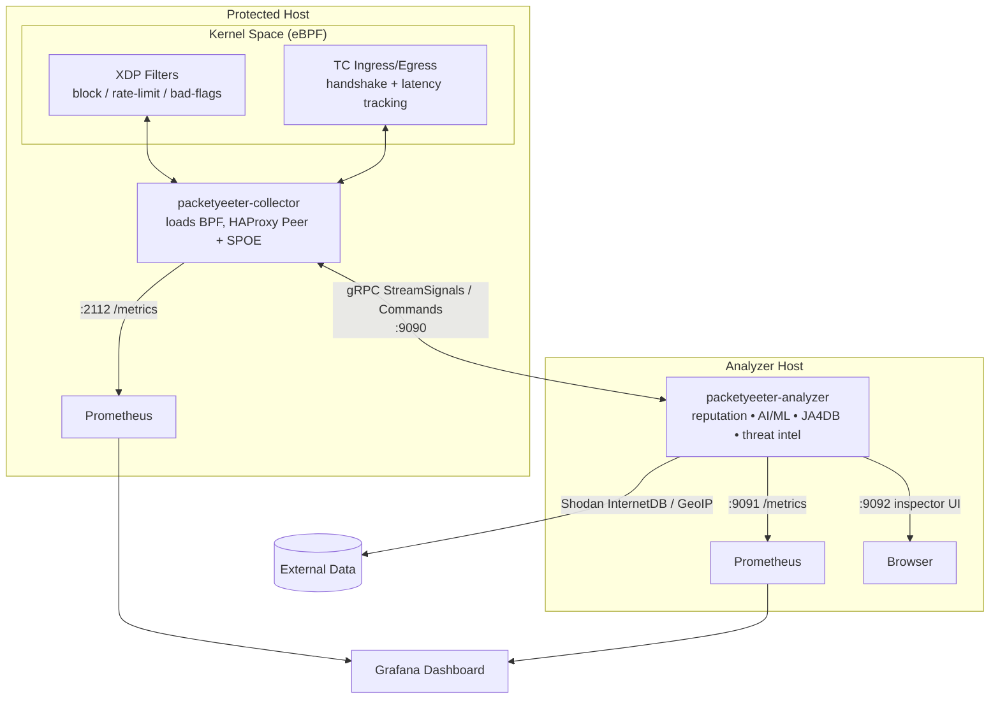

# PacketYeeter

PacketYeeter is a high-performance, eBPF-based DDoS protection and traffic filtering tool written in Go. It leverages the Linux Kernel's XDP (Express Data Path) and TC (Traffic Control) subsystems to inspect, classify, and drop malicious traffic at line rate.

## Key Features

1.  **SYN Flood Detection & Mitigation (Layer 4)**
    *   **Detection**: Uses eBPF TC (Ingress/Egress) to track TCP handshake states. It identifies source IPs that initiate connections (SYN) but fail to complete the handshake (ACK) within a configured timeout.
    *   **Mitigation**: Automatically adds malicious IPs to a kernel-space blocklist map.
    *   **Enforcement**: Use XDP to drop packets from blocked IPs instantly, before they reach the OS network stack.

2.  **TCP Flag Sanitization**
    *   Detects and blocks invalid TCP flag combinations commonly used in reconnaissance scans and attacks:
        *   **SYN-FIN** (Impossible state)
        *   **Xmas Tree** (FIN + PSH + URG)
        *   **NULL Scan** (No flags)
    *   Violating IPs are immediately banned.

3.  **IP Allowlist (CIDR Support)**
    *   Protect specific IPs or ranges (CIDR notation) from ever being blocked or rate-limited.
    *   Traffic from allowlisted sources bypasses all filters (XDP & TC) immediately.
    *   Supports both IPv4 and IPv6 CIDRs.

4.  **Volumetric Rate Limiting (ICMP & UDP)**
    *   **ICMP**: Limits the rate of ICMP packets from a single source to prevent ping floods.
    *   **UDP**: Strict rate limiting for UDP traffic to mitigate amplification/flood attacks.
    *   Thresholds are enforced directly in XDP for maximum performance.

5.  **Reputation Engine (Anomaly Scoring)**
    *   **Concept**: Assigns a numerical "Reputation Score" to every IP, JA4 fingerprint, and ASN interacting with the system.
    *   **Scoring**:
        *   Scores start at 0.
        *   Points are added for suspicious behaviors (e.g., +10 for JA4 abuse, +20 for High Latency, +15 for Proxy Lag).
        *   Scores degrade over time (decay factor 0.9 every 10m) to forgive transient issues.
    *   **Enforcement**: If a score exceeds the configured threshold (analyzer default: `75.0`, via `-reputation-threshold`), the entity is marked as a "Bad Actor" and subsequent traffic is dropped (or logged only in Dry-Run Mode).
    *   **Metrics**: `packetyeeter_reputation_score` (Gauge) tracks the current score of all tracked entities.

5.  **JA4T SSL/TCP Fingerprinting (Layer 4)**
    *   **Detection**: Passive TCP fingerprinting based on window size, TCP options, and ordering (JA4T format).
    *   **Behavior Analysis**: Tracks the frequency of unique fingerprints in real-time.
    *   **Abuse Detection**: Flags suspicious activity when a single fingerprint exceeds the configurable threshold within a 10s window.
    *   **Metrics**: Prometheus counters track unique abuse events.

6.  **JA4L / Latency Monitoring**
    *   **Detection**: Measures the RTT (Round Trip Time) of the TCP handshake (SYN-ACK -> ACK) passively via eBPF.
    *   **JA4L_C Format**: Logs latency fingerprints in `(RTT/2)_TTL` format (e.g., `11_128`), allowing easy identification of OS and physical distance.
    *   **Adaptive Baseline**: Maintains an EWMA per ASN to avoid penalizing inherently high-latency networks; flags spikes relative to each ASN.
    *   **Proxy Detection**: Extremely high latency on a handshake (>400ms) often indicates slow proxies, VPN chaining, or "Slowloris" attempts.
    *   **Alerting**: 
        *   Logs warnings for high latency events.
        *   Metrics: `packetyeeter_high_latency_handshakes_total` (Counter), `packetyeeter_high_latency_max_ms` (Gauge), `packetyeeter_latency_ewma_by_asn_ms` (GaugeVec).

7.  **GeoIP / ASN Intelligence**
    *   **Enrichment**: Integrates with MaxMind GeoLite2 ASN databases to tag metrics with Autonomous System (ASN) and Organization data.
    *   **Insights**: Break down latency, abuse events, and traffic anomalies by Provider (e.g., "Google Cloud", "DigitalOcean").
    *   **Metrics**:
        *   `packetyeeter_latency_by_asn_seconds` (Histogram): Latency distribution per ASN.
        *   `packetyeeter_abuse_by_asn_total` (Counter): Anomalies and blocks grouped by ASN.

8.  **HAProxy Stick-Table Integration (Layer 7)**
    *   Implements the HAProxy Peer Protocol (v2).
    *   Allows PacketYeeter to act as a "peer" to HAProxy, receiving stick-table updates (e.g., HTTP req rate limits, error rates) and blocking corresponding IPs at the XDP layer.

9.  **HAProxy SPOE / L7 Analytics (JA4H + AI Heuristics)**
    *   **Goal**: Detect proxies/bots via protocol latency, JA4H fingerprinting, and behavioral signals.
    *   **Mechanism**: HAProxy SPOE sends timestamps + HTTP features (JA4H via Lua, host, UA, headers, cookies) to PacketYeeter.
    *   **Logic**:
        *   Compare `Protocol Latency` vs network RTT (>200ms + RTT → anomaly).
        *   **JA4H** fingerprinting via upstream lua (`fingerprint_ja4h`).
        *   **Heuristics**: suspicious UA, missing headers, host-aware cookie expectations, honeypot paths, sequential path enumeration (alpha/numeric), low asset ratio (HTML >> assets).
        *   **Detection**:
            *   Static: `len(signals) >= 2` OR severe signals (`honeypot`, `numeric_seq`, `alpha_seq`).
            *   Adaptive (EWMA): per `host|ja4h` (fallback `host|ip`), detect when `ewma >= 1` and `current > ewma*3 + 2`.
    *   **Metrics**:
        *   `packetyeeter_client_req_time_ms` (Histogram)
        *   `packetyeeter_proxy_lag_max_ms` (Gauge)
        *   `packetyeeter_proxy_lag_ewma_by_asn_ms` (GaugeVec)
        *   `packetyeeter_spoe_anomaly_total` (Counter)
        *   `packetyeeter_spoe_handler_seconds` (Histogram)
        *   `packetyeeter_spoe_processing_seconds` (Histogram)
        *   `packetyeeter_spoe_queue_depth` (Gauge)
        *   `packetyeeter_spoe_queue_drops_total` (Counter)
        *   `packetyeeter_ai_signals_total` (Counter)
        *   `packetyeeter_ai_signals_by_type_total` (CounterVec)
        *   `packetyeeter_ai_signals_by_asn_total` (CounterVec)
        *   `packetyeeter_ai_detections_total` (Counter)
        *   `packetyeeter_ai_detections_by_asn_total` (CounterVec)
        *   `packetyeeter_ai_detections_by_ja4h_total` (CounterVec)
        *   `packetyeeter_ai_detections_by_ip_total` (CounterVec)
        *   `packetyeeter_ai_signal_ewma_by_asn` (GaugeVec)
        *   `packetyeeter_ai_signal_ewma_by_ja4h` (GaugeVec)

> **Consistency**: signals are canonicalized (case-insensitive) and block commands are deduped per IP to avoid double blocks from overlapping detectors.

> **Logging schema** (JSON): `component`, `event`, `ip`, `asn`, `ja4h`, `confidence`, `ml_confidence`, `ml_category`, `bot_category`, `reason`, `duration_secs`, `signal_count`, `signal_breakdown`, `source_breakdown`

> **Dashboards**: Prom/Influx dashboards map panels to metrics; see `docs/observability.md`.

11. **Monitor / Dry-Run Mode**
    *   Run the analyzer with `-dry-run` to log detections and update metrics **without** sending BLOCK commands to the collector. Useful for tuning thresholds without dropping traffic.

12. **Observability & Metrics**
    *   **Prometheus Exporters**: Each daemon exposes its own metrics endpoint (collector default `:2112`, analyzer default `:9091`) covering block counts, pps rates, reputation, and attack types.
    *   **Structured Logging**: All logs are emitted in JSON format for easy ingestion by Logstash/Fluentd/Vector.
    *   **Grafana Dashboard**: Includes a pre-built dashboard (`grafana-dashboard.json`) for visualizing attack traffic (IPs excluded in default dashboard; private dashboards can include IPs from metrics).

## Architecture

PacketYeeter runs as **two cooperating daemons** connected over gRPC:

*   **Collector** (`packetyeeter-collector`) — runs on each protected host. It loads the eBPF/XDP/TC programs, performs line-rate packet inspection and enforcement (blocking, rate limiting, flag sanitization), terminates the HAProxy Peer and SPOE protocols, and streams behavioral **signals** to the analyzer. It applies **BLOCK commands** returned by the analyzer directly in kernel-space maps. Requires root / BPF capabilities.
*   **Analyzer** (`packetyeeter-analyzer`) — a userspace-only "brain" that receives signals from one or more collectors, runs the reputation engine, AI/ML bot detection, JA4+ fingerprint lookups, GeoIP/ASN enrichment, and threat intelligence (Shodan InternetDB), then returns BLOCK commands. It needs no special privileges and can run on a separate host.



The `AnalyzerService` gRPC contract (`api/proto/v1/packetyeeter.proto`) exposes a bidirectional `StreamSignals(stream Signal) -> stream Command` channel (collector → analyzer signals, analyzer → collector commands) plus request/response RPCs for JA4H/JA4T lookups, bot/AI-crawler verification, threat intel, and reputation.

### Binaries

| Binary | Location | Purpose |
| :--- | :--- | :--- |
| `packetyeeter-collector` | `cmd/collector` | eBPF loader + enforcer, HAProxy Peer/SPOE, gRPC client. Root required. |
| `packetyeeter-analyzer` | `cmd/analyzer` | AI/ML + reputation + threat-intel gRPC server. No privileges needed. |
| `yeetctl` | `cmd/yeetctl` | CLI to inspect collector state over a UNIX socket. |
| `yeetexplorer` | `cmd/yeetexplorer` | Interactive terminal (TUI) dashboard for live inspection. |
| `labeler` | `cmd/labeler` | Offline tool to label captured sessions for ML training. |
| `packetyeeter` (legacy) | repo root (`make legacy`) | Optional combined single-binary build for backwards compatibility. |

## Prerequisites

*   **OS**: Linux (Kernel 5.4+ recommended) for the collector. The analyzer is portable userspace Go.
*   **Collector build dependencies**:
    *   `clang`, `llvm`
    *   `libbpf-dev`
    *   `linux-headers` (matching current kernel)
*   **Go**: 1.24+
*   **Proto (optional, only to regenerate)**: `buf`, `protoc-gen-go`, `protoc-gen-go-grpc` (`make install-buf`).

## Installation

1.  **Clone & Tidy**:
    ```bash
    git clone https://github.com/awlx/packetyeeter.git
    cd packetyeeter
    make deps
    ```

2.  **Build with the Makefile** (recommended):
    ```bash
    make            # proto + collector + analyzer
    make collector  # packetyeeter-collector only (needs the compiled BPF object, see below)
    make analyzer   # packetyeeter-analyzer only
    make yeetctl    # yeetctl CLI
    make legacy     # optional combined single-binary build
    ```

    The BPF object (`pkg/collector/ebpf/c/protector.bpf.o`) is embedded into the
    collector via `//go:embed`, so it must be compiled **before** building the
    collector:

    ```bash
    clang -O2 -g -target bpf -I/usr/include/x86_64-linux-gnu \
        -c pkg/collector/ebpf/c/protector.bpf.c \
        -o pkg/collector/ebpf/c/protector.bpf.o
    go build -o packetyeeter-collector ./cmd/collector
    ```

    > NOTE: `make test` / `go test ./...` needs the compiled `protector.bpf.o`
    > present (run the `clang` step or `deploy.sh` first).

3.  **Remote deployment** with `deploy.sh`:
    ```bash
    # Usage: ./deploy.sh <host> [collector|analyzer|both] [options]

    # Deploy both daemons to a host and install/enable systemd services
    ./deploy.sh webfrontend01.example.com both -i ens192 --install-service

    # Deploy only the collector, pointing it at a remote analyzer
    ./deploy.sh webfrontend01.example.com collector -i eth0 --analyzer-addr 10.0.0.5:9090

    # Deploy only the analyzer
    ./deploy.sh analyzer.example.com analyzer --listen-addr 0.0.0.0:9090

    # First-time host: install build deps too
    ./deploy.sh webfrontend01.example.com both --install-deps --install-service
    ```

    Options: `--install-deps`, `--install-service`, `--regen-proto`,
    `-i/--interface`, `--analyzer-addr`, `--listen-addr`, `--metrics-addr`.

## Usage

Start the **analyzer** first (anywhere; no root needed), then the **collector**
on each protected host pointing at the analyzer's gRPC address.

```bash
# Analyzer (brain) — listens for collectors on :9090, metrics on :9091
./packetyeeter-analyzer -listen-addr 0.0.0.0:9090 -metrics-addr :9091 \
    -geoip-asn /var/lib/GeoIP/GeoLite2-ASN.mmdb

# Collector (enforcer) — root required to load eBPF
sudo ./packetyeeter-collector -i eth0 -analyzer-addr 127.0.0.1:9090
```

### Collector Flags

| Flag | Default | Description |
| :--- | :--- | :--- |
| `-i` | `eth0` | Network interface to attach eBPF programs to. |
| `-analyzer-addr` | `127.0.0.1:9090` | Analyzer gRPC address to connect to. |
| `-metrics-addr` | `:2112` | Prometheus metrics HTTP listen address. |
| `-haproxy-port` | `8765` | HAProxy Peer protocol port. |
| `-spoe-port` | `9876` | HAProxy SPOE agent port. |
| `-socket` | `/var/run/packetyeeter-collector.sock` | UNIX socket for `yeetctl`. |
| `-geoip-asn` | `""` | Path to `GeoLite2-ASN.mmdb` for ASN enrichment. |
| `-allowlist` | `""` | Comma-separated CIDRs to bypass all filtering (IPv4/IPv6). |
| `-block-duration` | `5m` | Default duration to keep an IP blocked. |
| `-poll-interval` | `1s` | How often to poll the eBPF maps. |
| `-signal-queue-size` | `10000` | Collector → analyzer signal queue size. |
| `-v` | `false` | Verbose logging. |

### Analyzer Flags

| Flag | Default | Description |
| :--- | :--- | :--- |
| `-listen-addr` | `0.0.0.0:9090` | gRPC listen address for collectors. |
| `-metrics-addr` | `:9091` | Prometheus metrics HTTP listen address. |
| `-inspect-addr` | `127.0.0.1:9092` | Read-only HTTP inspector UI address. |
| `-geoip-asn` | `""` | Path to `GeoLite2-ASN.mmdb` for ASN enrichment. |
| `-reputation-threshold` | `75.0` | Reputation score at which an entity is treated as a bad actor. |
| `-reputation-max-entries` | `500000` | Max tracked reputation entries. |
| `-reputation-max-age` | `24h` | Max age before a reputation entry is evicted. |
| `-reputation-asn-max-hosts` | `5000` | Max tracked hosts per ASN. |
| `-ai-confidence-threshold` | `0.7` | Minimum AI confidence to flag a bot/scraper. |
| `-ai-workers` | `16` | AI detection worker pool size. |
| `-ai-queue-size` | `10000` | AI detection queue size. |
| `-ml-model` | `""` | Optional path to an ONNX ML model. |
| `-ddos-min-incomplete` | `400` | Min incomplete handshakes for a DDoS categorization. |
| `-ddos-min-pattern` | `800` | Min pattern matches for a DDoS categorization. |
| `-ddos-min-total` | `1500` | Min total events for a DDoS categorization. |
| `-ddos-require-highfreq` | `true` | Require high-frequency traffic for DDoS categorization. |
| `-disable-ddos-category` | `false` | Disable the DDoS categorization path. |
| `-enable-high-cardinality-metrics` | `false` | Emit per-IP / per-JA4H high-cardinality metrics. |
| `-enable-pprof` | `false` | Enable the pprof HTTP server. |
| `-pprof-addr` | `:6060` | pprof listen address. |
| `-dry-run` | `false` | Log detections but do not send BLOCK commands (Monitor Mode). |
| `-v` | `false` | Verbose logging. |

> Threat intelligence uses the free, **keyless** Shodan InternetDB API — no API key is required.

## Observability & Dashboard

PacketYeeter is designed to be monitored via **Prometheus** and **Grafana**.

1.  **Metrics Endpoints**:
    *   Collector: `http://<collector-host>:2112/metrics`
    *   Analyzer: `http://<analyzer-host>:9091/metrics`

    All metrics are prefixed `packetyeeter_`. Key series include:

    *   `packetyeeter_tcp_blocks_total`, `packetyeeter_udp_blocks_total`, `packetyeeter_icmp_blocks_total`, `packetyeeter_haproxy_blocks_total`: blocks by protocol/source.
    *   `packetyeeter_tcp_syn_flood_blocks_total`: SYN flood blocks.
    *   `packetyeeter_tcp_bad_flags_blocks_total`: invalid TCP flag blocks.
    *   `packetyeeter_udp_max_rate_pps`, `packetyeeter_icmp_max_rate_pps`: peak UDP/ICMP PPS.
    *   `packetyeeter_ja4t_suspicious_total`: suspicious JA4T abuse events.
    *   `packetyeeter_high_latency_handshakes_total`, `packetyeeter_high_latency_max_ms`, `packetyeeter_latency_ewma_by_asn_ms`: JA4L latency signals.
    *   `packetyeeter_proxy_lag_max_ms`, `packetyeeter_proxy_lag_ewma_by_asn_ms`, `packetyeeter_client_req_time_ms`: SPOE / proxy-lag signals.
    *   `packetyeeter_reputation_score`: current reputation score per entity.
    *   `packetyeeter_ai_signals_total`, `packetyeeter_ai_detections_total` (plus `_by_asn`, `_by_ja4h`, `_by_ip`, `_by_type` variants): AI bot/scraper signals and detections.
    *   `packetyeeter_ml_*`, `packetyeeter_ja4db_*`, `packetyeeter_bot_verification_*`, `packetyeeter_threat_intel_*`, `packetyeeter_rate_limit_*`: ML inference, JA4DB, bot verification, threat-intel, and rate-limiter metrics.

    See [`docs/observability.md`](docs/observability.md) for the full metric catalog and dashboard panel mappings.

2.  **Inspector UI**:
    The analyzer serves a read-only web inspector at `http://127.0.0.1:9092`
    (`-inspect-addr`) for live inspection of sessions, detections, and reputation.

3.  **Grafana Dashboard**:
    A production-ready dashboard is included: `grafana-dashboard.json`. Import it
    into Grafana with a Prometheus data source configured. The default dashboard
    excludes IPs; build a private dashboard if IP visibility is needed.

4.  **Logs**:
    Logs are output in structured JSON format, e.g.:
    ```json
    {"action":"WOULD BLOCK (Dry Run)","ip":"192.0.2.15","level":"warning","msg":"Rate Limit Exceeded","pps":5323,"reason":"rate_limit_exceeded","time":"..."}
    ```

## Management CLI (`yeetctl`)

`yeetctl` inspects the **collector**'s state over its UNIX socket. Point `-sock`
at the collector's socket (its default is `/var/run/packetyeeter-collector.sock`,
while `yeetctl`'s own default is `/var/run/packetyeeter.sock`).

```bash
SOCK=/var/run/packetyeeter-collector.sock

# List currently blocked IPs and their remaining TTL
sudo ./yeetctl -sock $SOCK list

# View current reputation scores (entities with score > 0)
sudo ./yeetctl -sock $SOCK reputation

# Show AI detection summaries (by IP, JA4H, ASN)
sudo ./yeetctl -sock $SOCK ai

# Show verified/unverified bot activity
sudo ./yeetctl -sock $SOCK bots
```

For an interactive live view, run `yeetexplorer` (a terminal UI dashboard).

## Running as a Service (Systemd)

PacketYeeter ships two systemd units — one per daemon. `make install-services`
copies them into place, or install manually:

1.  **Install binaries**:
    ```bash
    sudo mkdir -p /opt/packetyeeter/collector /opt/packetyeeter/analyzer
    sudo cp packetyeeter-collector /opt/packetyeeter/collector/
    sudo cp packetyeeter-analyzer  /opt/packetyeeter/analyzer/
    ```

2.  **Install config & units**:
    ```bash
    sudo cp packetyeeter-collector.default /etc/default/packetyeeter-collector
    sudo cp packetyeeter-analyzer.default  /etc/default/packetyeeter-analyzer
    sudo cp packetyeeter-collector.service /etc/systemd/system/
    sudo cp packetyeeter-analyzer.service  /etc/systemd/system/
    ```

3.  **Configure**:
    Edit `/etc/default/packetyeeter-collector` (interface, analyzer address, allowlist, …)
    and `/etc/default/packetyeeter-analyzer` (listen address, GeoIP path, …).
    The collector runs with `CAP_SYS_ADMIN/NET_ADMIN/BPF/PERFMON/NET_RAW` and
    `LimitMEMLOCK=infinity`; the analyzer runs hardened (`NoNewPrivileges`,
    `ProtectSystem=strict`, `ReadWritePaths=/var/lib/packetyeeter`).

4.  **Enable & start** (start the analyzer first; the collector `Wants` it):
    ```bash
    sudo systemctl daemon-reload
    sudo systemctl enable --now packetyeeter-analyzer
    sudo systemctl enable --now packetyeeter-collector
    ```

5.  **View logs**:
    ```bash
    journalctl -u packetyeeter-collector -f
    journalctl -u packetyeeter-analyzer -f
    ```

## Testing Scripts

The `scripts/` directory contains Python/Scapy utilities to test detection and
tooling for the ML pipeline:

*   **SYN Flood**: `python3 scripts/flood_test.py <TargetIP> --count 500`
*   **Bad Flags**: `python3 scripts/flag_test.py <TargetIP> --count 20`
*   **ML pipeline**: training/evaluation helpers such as `train_model.py`,
    `train_advanced_model.py`, `evaluate_model.py`, and `sessions_to_training.py`.

## License

PacketYeeter is licensed under **GPL-2.0** (required for Kernel BPF compatibility).
The full license text is available in [`LICENSE`](LICENSE).

### Third-Party Algorithm Licensing (JA4+)

PacketYeeter implements fingerprinting derived from the **JA4+ suite**
(JA4H, JA4T, JA4L). These algorithms originate from
[FoxIO-LLC/ja4](https://github.com/FoxIO-LLC/ja4) and are subject to the
**FoxIO License 1.1**, which is separate from and additional to the GPL-2.0
license covering PacketYeeter's own code:

*   The original **JA4** (TLS client) algorithm is BSD-3-Clause licensed.
*   The **JA4+ algorithms** (including JA4H/JA4T/JA4L) are licensed under the
    [FoxIO License 1.1](https://github.com/FoxIO-LLC/ja4/blob/main/LICENSE),
    which permits open-source and internal use but restricts commercial
    redistribution. If you intend to use PacketYeeter commercially, review the
    FoxIO License terms and contact FoxIO LLC regarding the JA4+ components.

See [`NOTICE`](NOTICE) for full third-party attribution.
